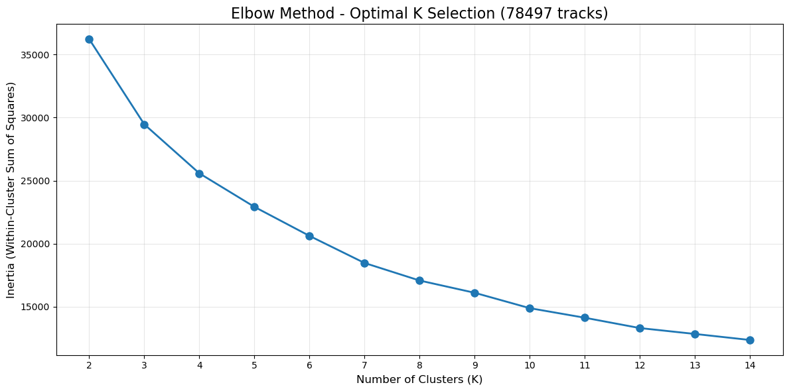
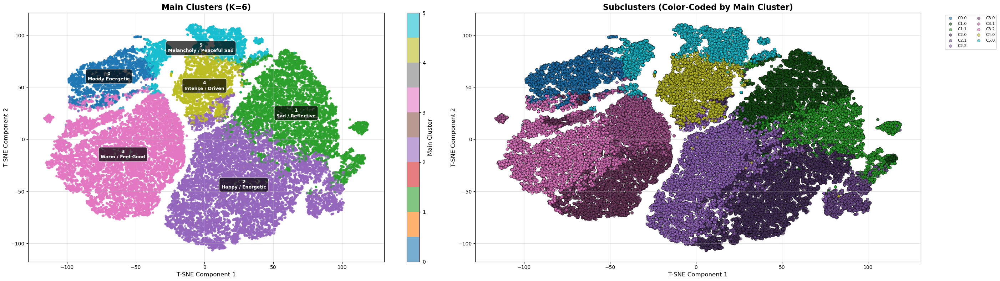
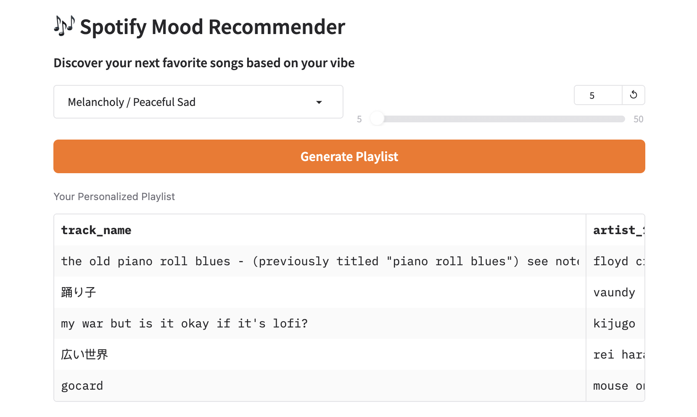
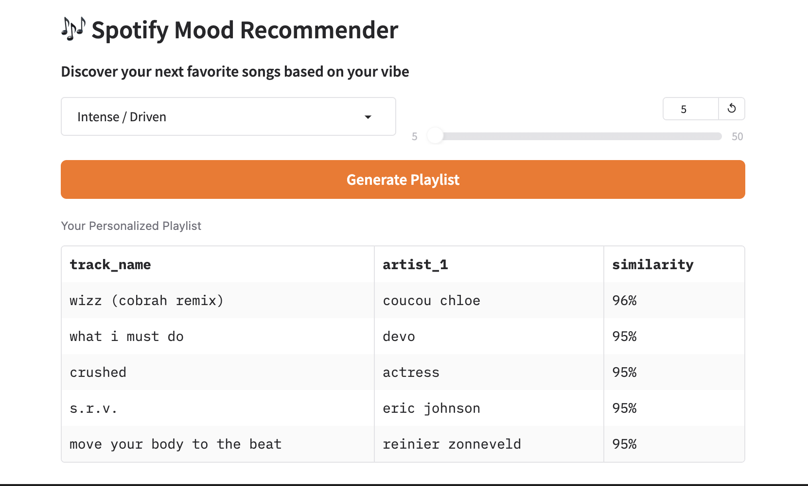

# Spotify Music Recommendation System

A mood-based music recommendation system using K-Means clustering, hierarchical subclustering, and cosine similarity on Spotify audio features.

## 🎯 Project Overview

This project builds a personalized music recommendation engine by:
1. Cleaning and preprocessing 114,000 Spotify tracks
2. Clustering songs into 6 mood-based categories with subclusters
3. Matching personal library against the global dataset
4. Generating recommendations using cosine similarity and proportional allocation

## 📊 Dataset

- **Source**: Spotify tracks dataset with audio features
- **Initial size**: 114,000 tracks × 21 features
- **Cleaned dataset**: 78,497 tracks × 20 features
- **Personal library**: 13,079 songs (478 matched with global dataset)

### Audio Features Used
- **Danceability**: Rhythm suitability for dancing (0-1)
- **Energy**: Intensity and activity measure (0-1)
- **Valence**: Musical positivity (0-1)
- **Acousticness**: Acoustic quality confidence (0-1)
- **Speechiness**: Presence of spoken words (0-1)
- **Instrumentalness**: Vocal content prediction (0-1)
- **Liveness**: Audience presence detection (0-1)
- **Tempo**: Beats per minute (scaled 0-1)
- **Loudness**: Overall volume in dB (scaled 0-1, reversed)

## 🛠️ Methodology

### 1. Data Cleaning (`01_spotify_data_cleaning.ipynb`)
- Handle missing values (3 rows)
- Remove invalid data (loudness > 0 dB, tempo ≤ 0, duration ≤ 0)
- Standardize text columns (lowercase, strip whitespace)
- Scale tempo and loudness features
- Final dataset: 78,497 valid tracks

### 2. Clustering Approach
- **Main clusters (K=6)**: Broad mood categories using K-Means
  - Cluster 0: Moody Energetic
  - Cluster 1: Sad / Reflective
  - Cluster 2: Happy / Energetic
  - Cluster 3: Warm / Feel-Good
  - Cluster 4: Intense / Driven
  - Cluster 5: Melancholy / Peaceful Sad

- **Subclusters**: Hierarchical clustering within each main cluster for nuanced variations

### 3. Recommendation System (`02_recommendation_system.ipynb`)

#### Personal Library Processing
1. Load user's Spotify library from JSON export
2. Clean and standardize track/artist names
3. Remove duplicates (13,079 → 12,361 unique tracks)
4. Match against global dataset (478 songs found)
5. Inherit cluster assignments

#### Recommendation Engine
1. **User Profile Creation**: Calculate average audio features from user's songs in each subcluster
2. **Proportional Allocation**: Distribute recommendations based on user's subcluster distribution
3. **Cosine Similarity**: Rank candidates by similarity to user profile
4. **Filtering**: Exclude songs already in user's library

## 📈 Visualizations

### Elbow Method — Optimal K Selection


The elbow curve across K=2–14 clusters shows a clear inflection point around K=6, justifying the choice of 6 main mood clusters.

### T-SNE Cluster Visualization


The visualization shows:
- **Left plot**: 6 main mood-based clusters with labeled centers
- **Right plot**: Subclusters color-coded by parent cluster, showing fine-grained variations

T-SNE dimensionality reduction is used to project high-dimensional audio features into 2D space for visualization.

### Recommendation Interface



The interactive recommender widget (built in Jupyter) lets you select a mood and number of songs, then returns a ranked playlist with track name, artist, and cosine similarity score.

## 🚀 Getting Started

### Prerequisites
```bash
pip install pandas numpy scikit-learn matplotlib seaborn joblib
```

### Usage

1. **Clean the dataset**:
```bash
jupyter notebook 01_spotify_data_cleaning.ipynb
```

2. **Build recommendation system**:
```bash
jupyter notebook 02_recommendation_system.ipynb
```

3. **Get recommendations**:
```python
recommendations = recommend_songs(
    mood='Sad / Reflective',  # Choose from 6 mood clusters
    n_songs=20,               # Number of recommendations
    user_library=personal_df  # Your matched library
)
```

## 📁 Project Structure

```
├── 01_spotify_data_cleaning.ipynb    # Data cleaning and preprocessing
├── 02_recommendation_system.ipynb    # Clustering and recommendation engine
├── dataset.csv                       # Raw Spotify dataset (not included)
├── dataset_cleaned.csv               # Cleaned dataset (generated)
├── yourlibrary.json                  # Personal Spotify library export
├── tempo_scaler.joblib               # Fitted tempo scaler
├── loudness_scaler.joblib            # Fitted loudness scaler
└── images/
    └── cluster_visualization.png     # T-SNE cluster plots
```

## 🔬 Technical Details

### Clustering Performance
- **Silhouette Score**: Evaluates cluster quality
- **Main clusters**: Optimized using elbow method (K=6)
- **Subclusters**: Adaptive hierarchical clustering per main cluster

### Recommendation Algorithm
```
For each mood request:
1. Identify user's subclusters in that mood
2. Calculate distribution (e.g., 73% subcluster A, 27% subcluster B)
3. Allocate recommendations proportionally (e.g., 15 songs from A, 5 from B)
4. For each subcluster:
   - Calculate user profile (mean audio features)
   - Find candidate songs (same subcluster, not owned)
   - Rank by cosine similarity
   - Select top N recommendations
5. Combine and return
```

## 📊 Results

- **Coverage**: System can recommend from 78,497 unique tracks
- **Personalization**: Leverages 478 matched songs from personal library
- **Mood diversity**: 6 distinct mood categories with fine-grained subclusters
- **Balance**: Proportional allocation maintains user's listening style within each mood

## 🎵 Mood Categories

1. **Moody Energetic**: High energy, lower valence, driving intensity
2. **Sad / Reflective**: Low valence, low energy, high acousticness
3. **Happy / Energetic**: High valence, high energy, high danceability
4. **Warm / Feel-Good**: Medium-high valence, moderate energy
5. **Intense / Driven**: Very high energy, high tempo, low acousticness
6. **Melancholy / Peaceful Sad**: Low energy, high acousticness, introspective

## 🔮 Future Enhancements

- [ ] Integrate Spotify API for real-time track features
- [ ] Add genre-based filtering
- [ ] Implement collaborative filtering
- [ ] Build web interface for recommendations
- [ ] Add temporal features (release year, popularity trends)
- [ ] Hybrid recommendation (content + collaborative)

## 📝 License

This project is open source and available for educational purposes.

## 🙏 Acknowledgments

- Spotify for the audio features dataset
- scikit-learn for clustering and ML tools
- The music recommendation research community

---

**Note**: This is an academic project for demonstrating clustering and recommendation algorithms. For production use, consider Spotify's official API and recommendation services.
